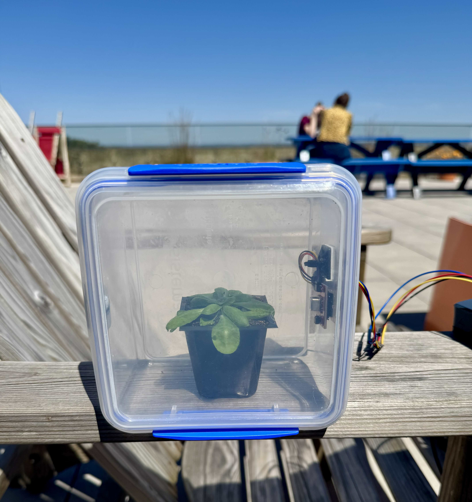
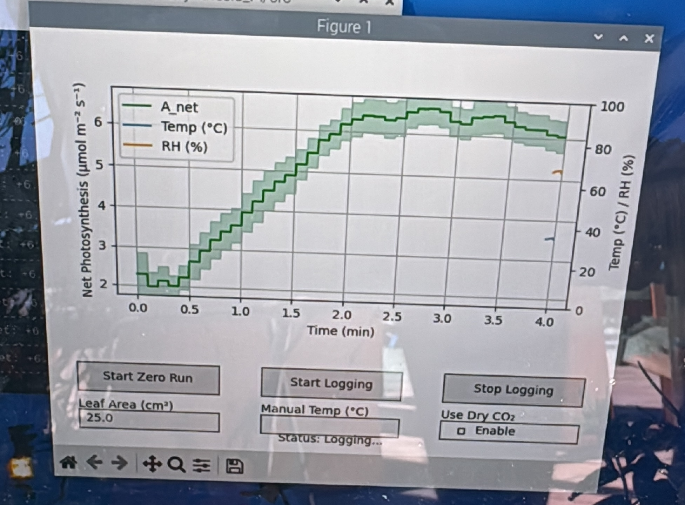

# Lunchbox Photosynthesis

Code for sandwich box photosynthesis logger.

  
  

## Notes

- Box screens about ~15% of PAR (testing with licor PAR sensor).
- The SCD40 sensor has an auto calibration on CO2, but requires it to be outside for some period of time. Ultimately this doesn't matter if logging relative change, but worth noting. I tested forcing the CO2 to a new minimum, but this doesn't really work.
- The SCD40's temperature logger is biased high when in direct light. I suspect if we add a "Stevenson screen", i.e. a piece of cardboard, this might be sufficient
