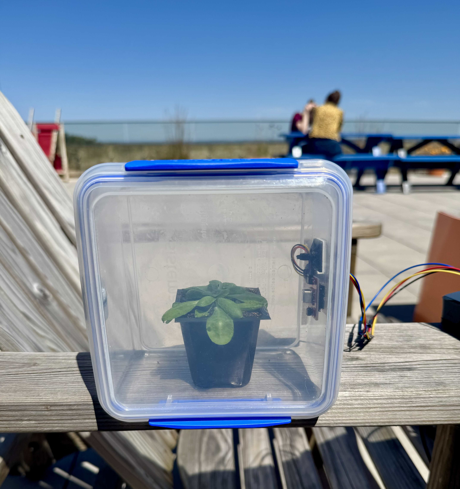
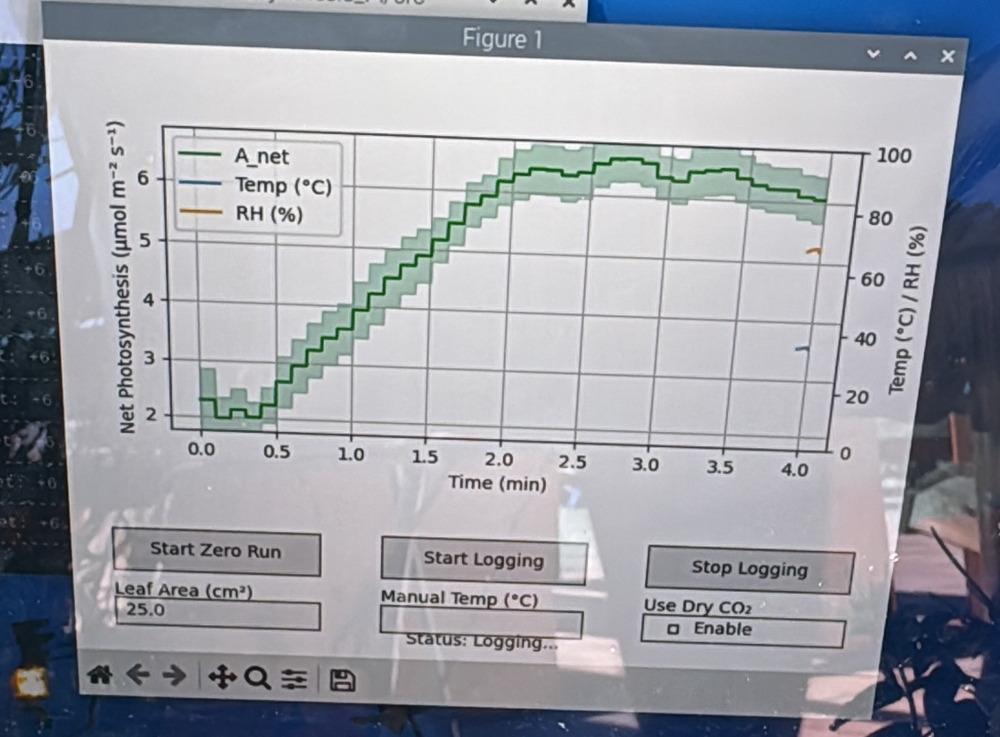

# Lunchbox Photosynthesis

Code for sandwich box photosynthesis logger. A plant in a small pot is sealed in a lunchbox with a CO₂ sensor; the rate at which CO₂ falls gives the plant's net assimilation rate (A_net).


<p float="left">
  
  
</p>

## Hardware

- Infineon XENSIV PAS CO₂ sensor on its USB evaluation board, talking UART at 9600 baud. The port is found automatically (`/dev/tty.usbmodem*` on macOS, the first USB COM port on Windows).
- A 0.5 l lunchbox and a square pot, 5.0 cm top × 3.4 cm base × 5.3 cm deep. If you change the box or pot, edit the constants at the top of `src/python/lunchbox_logger.py` (`BOX_VOLUME_L`, `POT_TOP_CM`, `POT_BASE_CM`, `POT_HEIGHT_CM`).

## Setup

```
pip install numpy scipy statsmodels matplotlib
```

pyserial 3.5 is bundled in `src/python/serial`, so it does not need to be installed.

If the bundled copy ever fails to import, install pyserial yourself (`pip install --user pyserial`), then delete or rename the `src/python/serial` folder and restart the QtConsole kernel (Kernel → Restart). Python will then use the installed copy.

Run the scripts from `src/python`.

## Running an experiment

1. **Calibrate (optional, once).** With the box open and the sensor settled in steady air for a few minutes:
   ```
   python calibrate_xensiv_pas_co2_sensor.py --ref 440
   ```
   This tells the sensor the current air is 440 ppm. It works indoors; the value can be a reading from another sensor or just a nominal number, in which case treat the ppm as relative. The offset is saved in the sensor and survives power cycles. It only changes the absolute ppm, A_net is unaffected. `--reset` restores the factory calibration, `--no_save` tries it without storing.

2. **Measure soil respiration (optional).** Put the pot with just soil in the closed box:
   ```
   python calc_soil_respiration_correction.py
   ```
   Options: `--temp`, `--window_size` (as below) and `--ignore_initial_min` (default 2, skip estimates while the box settles).
   Leave it for 10 min or so, then close the window. It prints the soil CO₂ efflux (μmol m⁻² soil s⁻¹) and the flag to use, e.g. `--soil_resp_correction 0.412`.

3. **Measure the plant.** Close the box with the plant inside:
   ```
   python plot_lunchbox_photosynthesis.py --leaf_area 25 --save
   ```
   On the left, the top panel shows CO₂ and the bottom A_net with its 95% confidence band; A_net appears once the slope window has filled (about 2 min). On the right, A_net is plotted against CO₂ for the whole run, coloured by time: as the plant draws the box down this traces its CO₂ response curve.

   The plant draws CO₂ down quickly (a 25 cm² leaf at 5 μmol m⁻² s⁻¹ removes about 45 ppm a minute), and A_net falls as CO₂ runs out. Below 250 ppm (`--low_co2`) the status line turns red: open the box to let it refill.

### Options for `plot_lunchbox_photosynthesis.py`

| Flag | Default | Meaning |
|---|---|---|
| `--leaf_area` | 25 | Leaf area (cm²); A_net is per m² of leaf |
| `--temp` | 20 | Air temperature in the box (°C) |
| `--soil_resp_correction` | 0 (off) | Soil CO₂ efflux from step 2 (μmol m⁻² soil s⁻¹, positive) |
| `--no_plant_pot` | off | Empty box: no pot volume, A_net per box instead of per m² |
| `--interval` | 5 | Sensor measurement interval (s), minimum 5 |
| `--window_size` | 24 | Readings in the slope window (24 × 5 s = 2 min) |
| `--ols` | off | Plain least squares instead of the robust fit |
| `--fixed_ylim` | off | Keep the A_net axis at −5 to 15 instead of rescaling it |
| `--low_co2` | 250 | Warn when box CO₂ falls below this (ppm) |
| `--save` | off | Log every reading to `lunchbox_<date>_<time>.csv` |

The CSV has columns `time, elapsed_s, co2_ppm, anet, anet_lower, anet_upper` (A_net columns are empty until the window fills).

## How A_net is calculated

Every 5 s the sensor gives a new CO₂ reading. A robust (Huber) linear fit over the last 24 readings gives the rate of change, `dCO₂/dt` (ppm s⁻¹), and its standard error. The ideal gas law turns that into a flux:

```
flux (μmol s⁻¹) = dCO₂/dt × p × V / (R × T)
```

with p = 101325 Pa, V = box air volume (box minus pot, 0.405 l), R = 8.314 J mol⁻¹ K⁻¹ and T from `--temp`.

- **Sign:** carbon uptake is positive. CO₂ falling in the box gives positive A_net; CO₂ rising (dark, respiration) gives negative A_net.
- **Soil respiration:** soil adds CO₂ all the time, so the measured uptake is leaf uptake minus soil efflux. The correction is scaled from soil area (the pot top) to the box and added back to every reading, then A_net is divided by leaf area.

## Sensor behaviour worth knowing

- The sensor measures every 5 s at fastest (hardware limit). Readings are integers (1 ppm resolution) with noise of roughly ±10 ppm, so a 2 min window resolves A_net to about ±0.2 μmol m⁻² s⁻¹ for a 25 cm² leaf.
- All settings except a saved calibration are lost on power off. At power up the sensor is idle, measuring every 60 s, with automatic baseline correction (ABOC) on. The scripts configure it each time: 5 s rate, pressure reference, ABOC off (ABOC assumes it regularly sees fresh air, and would shift the offset mid-experiment).
- The first few readings after a reset jump around; the logger discards the first 4.
- After a calibration, readings swing wildly for a few samples (even below zero) while the new offset settles. The calibration script waits these out.
- With the box open, changes in room CO₂ (people, ventilation) show up as a false A_net, so the box must be closed when measuring.

## Troubleshooting

- **`No USB COM port found on Windows` / `No /dev/tty.usbmodem* device found`:** the sensor isn't plugged in, or another program (e.g. the Infineon GUI, another script) has the port open.
- **`Failed to import any of the following Qt binding modules` (Windows):** the plot script uses Qt for its window and falls back to Tk if Qt isn't available. If no window appears, run `pip install pyqt5`, then restart the QtConsole kernel (Kernel → Restart).
- **CO₂ reads 0:** the sensor is idle; any of the scripts will start it.
- **`python reset_sensor.py`** soft resets the sensor if it seems stuck.

## Files

`src/python`, current (Xensiv sensor):

- `plot_lunchbox_photosynthesis.py`: live CO₂ and A_net plot, the main script.
- `lunchbox_logger.py`: reads the sensor and calculates A_net; box geometry constants.
- `xensiv_pas_co2_sensor.py`: sensor driver (UART register protocol, calibration).
- `calc_soil_respiration_correction.py`, `calibrate_xensiv_pas_co2_sensor.py`, `reset_sensor.py`: see above.
- `serial_port_finder.py`: finds the USB port.
- `co2_test.py`, `co2_xensiv_checker_plot.py`: quick CO₂-only plots for checking the sensor.

Older:

- `calc_Anet.py`, `co2_monitor.py`, `plot_Anet.py`: for the earlier SCD40 sensor (need `qwiic_scd4x`).
- `xensiv_pas_co2_gui_csv_to_plot.py`, `plot_realtime_Anet_from_csv.py`: plot CSVs saved by Infineon's own GUI (`PAS_CO2_datalog_*.csv`).
- `old_sensiv_pas_plotting_script.py`: the logger before it was split into logger and plotter.

`src/R`:

- `plot_lunchbox_photosynthesis.R`: Shiny version of the live plot, calls the Python logger via reticulate (edit the Python path and settings at the top).
- `app.R`: Shiny plot of an Infineon GUI CSV.

## Notes

- Box screens about ~15% of PAR (testing with licor PAR sensor).
- The box warms up in direct light (the plastic acts like a greenhouse), so set `--temp` to the air temperature inside the box, not the room. A white yogurt-pot "Stevenson screen" or insulation tape might help; it is hard to use the tape with the light sources the students have, as they need to be angled in different ways.
- Adding a fan has mixed results. It does lead to higher measured values, but it looks like you need to pulse things (turn it on and off). If it is too close to the sensor and I think it ends up blowing moisture onto the sensor as the RH goes to 100%. Going to test moving the fan a long way from the sensor and to box off the sensor.
- Parafilming the soil suppresses soil respiration well, as an alternative to (or check on) `--soil_resp_correction`.
- The A_net calculation (robust linear fit) still needs testing with a plant.
